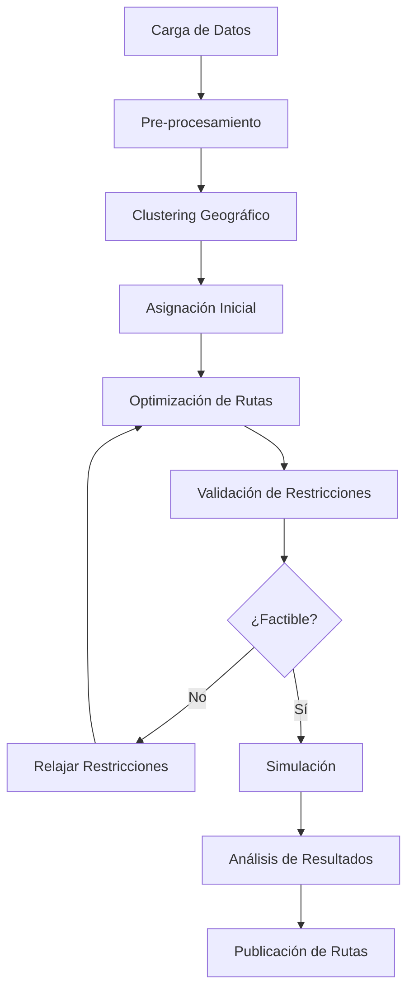

# Arquitectura del Sistema de Optimización de Rutas Multi-Planta

## Descripción del Problema

Optimizar el transporte de 1000 operarios entre 3 plantas industriales, utilizando una flota heterogénea de buses (40, 20 y 10 pasajeros) en 3 turnos de trabajo.

## Objetivos de Optimización

1. **Minimizar costos operacionales**
   - Combustible
   - Desgaste de vehículos
   - Horas conductor

2. **Minimizar tiempo total de transporte**
   - Tiempo de espera
   - Tiempo en ruta

3. **Maximizar utilización de flota**
   - Ocupación de buses
   - Distribución eficiente por capacidad

## Arquitectura del Sistema

### 1. Capa de Datos

```
┌─────────────────────────────────────────────────────────┐
│                    Base de Datos                        │
├─────────────────────────────────────────────────────────┤
│ • Plantas (ubicación, capacidad, horarios)              │
│ • Operarios (planta origen, planta destino, turno)      │
│ • Flota (tipo bus, capacidad, disponibilidad)          │
│ • Rutas históricas (distancias, tiempos, costos)       │
│ • Restricciones (legales, sindicales, operacionales)   │
└─────────────────────────────────────────────────────────┘
```

### 2. Motor de Optimización

```
┌─────────────────────────────────────────────────────────┐
│              Motor de Optimización VRP                  │
├─────────────────────────────────────────────────────────┤
│ Algoritmos:                                             │
│ • Fase 1: Clustering de operarios por zona/ruta        │
│ • Fase 2: Asignación de buses por capacidad            │
│ • Fase 3: Optimización de rutas (OR-Tools/Gurobi)      │
│ • Fase 4: Ajuste fino con metaheurísticas              │
└─────────────────────────────────────────────────────────┘
```

### 3. Modelo Matemático

#### Variables de Decisión:
- `x[i,j,k,b]`: Bus b viaja de punto i a punto j en turno k
- `y[o,b]`: Operario o asignado al bus b
- `t[i,k]`: Tiempo de llegada al punto i en turno k

#### Función Objetivo:
```
Minimizar: α·CostoTotal + β·TiempoTotal + γ·(1-Utilización)
```

#### Restricciones Principales:
1. **Capacidad**: Σ y[o,b] ≤ Capacidad[b]
2. **Cobertura**: Cada operario debe ser transportado
3. **Ventanas de tiempo**: Llegada antes del inicio del turno
4. **Continuidad de ruta**: Entrada = Salida para cada nodo
5. **Disponibilidad de flota**: Buses disponibles por turno

### 4. Arquitectura de Software

```yaml
Microservicios:
  
  1. Servicio de Gestión de Datos:
     - API REST para CRUD de plantas/operarios/flota
     - Integración con sistemas HR/ERP
     - Cache Redis para datos frecuentes
  
  2. Servicio de Optimización:
     - Worker Celery para procesamiento asíncrono
     - OR-Tools para VRP
     - Almacenamiento de soluciones en S3
  
  3. Servicio de Simulación:
     - Motor de eventos discretos
     - Análisis what-if
     - Validación de restricciones
  
  4. Servicio de Monitoreo Real-Time:
     - Tracking GPS de flota
     - Ajustes dinámicos
     - Alertas y notificaciones
```

### 5. Flujo de Proceso



### 6. Estructura de Datos Clave

```typescript
interface Plant {
  id: string;
  name: string;
  location: Coordinates;
  shifts: Shift[];
  capacity: number;
}

interface Operator {
  id: string;
  homeLocation: Coordinates;
  assignedPlant: string;
  shift: string;
  pickupPoint?: string;
}

interface Bus {
  id: string;
  type: 'large' | 'medium' | 'small';
  capacity: 40 | 20 | 10;
  costPerKm: number;
  availability: TimeWindow[];
}

interface Route {
  id: string;
  bus: Bus;
  shift: string;
  stops: RouteStop[];
  passengers: Operator[];
  distance: number;
  duration: number;
  cost: number;
}

interface RouteStop {
  location: Coordinates;
  arrivalTime: Date;
  departureTime: Date;
  passengersIn: string[];
  passengersOut: string[];
}
```

### 7. Algoritmo de Optimización por Fases

#### Fase 1: Clustering Inteligente
```python
def cluster_operators(operators, plants, n_clusters):
    # Agrupar operarios por:
    # - Proximidad geográfica
    # - Planta destino
    # - Horario de turno
    # Usar K-means con restricciones
```

#### Fase 2: Asignación de Capacidad
```python
def assign_bus_capacity(clusters):
    # Asignar buses grandes a clusters densos
    # Buses medianos a rutas intermedias
    # Buses pequeños para zonas dispersas
    # Considerar costo/beneficio
```

#### Fase 3: Optimización de Rutas
```python
def optimize_routes(clusters, buses, constraints):
    # Usar OR-Tools Routing
    # Definir matriz de costos/tiempos
    # Aplicar restricciones de capacidad
    # Ventanas de tiempo por turno
```

#### Fase 4: Post-Optimización
```python
def improve_solution(initial_solution):
    # Aplicar metaheurísticas:
    # - Simulated Annealing
    # - Tabu Search
    # - Genetic Algorithm
    # Para mejora incremental
```

### 8. Métricas de Desempeño

1. **KPIs Operacionales**
   - Costo por operario transportado
   - Tiempo promedio de viaje
   - Utilización de flota (%)
   - Puntualidad de llegadas

2. **KPIs de Optimización**
   - Gap de optimalidad
   - Tiempo de cómputo
   - Mejora vs solución manual
   - Robustez ante cambios

### 9. Consideraciones de Implementación

1. **Escalabilidad**
   - Usar algoritmos de aproximación para > 1000 operarios
   - Paralelización de cálculos
   - Cache de rutas frecuentes

2. **Flexibilidad**
   - Parámetros configurables
   - Restricciones soft/hard
   - Escenarios múltiples

3. **Integración**
   - APIs para sistemas externos
   - Exportación a formatos estándar
   - Webhooks para eventos

### 10. Stack Tecnológico Recomendado

**Backend:**
- Python + FastAPI (API REST)
- Celery + Redis (Procesamiento asíncrono)
- OR-Tools/Gurobi (Optimización)
- PostgreSQL + PostGIS (Base de datos espacial)

**Frontend:**
- React + TypeScript
- Mapbox/Leaflet (Visualización de mapas)
- D3.js (Visualización de datos)
- Socket.io (Actualizaciones real-time)

**Infraestructura:**
- Docker + Kubernetes
- AWS/GCP para escalabilidad
- Prometheus + Grafana (Monitoreo)
- ElasticSearch (Logs y búsqueda)